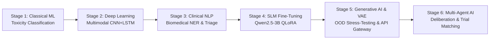

# Multi-Stage Clinical AI Platform: Comprehensive 6-Stage System Report

An end-to-end, multi-stage Oncology Clinical Decision Support System (CDSS) for patient risk prediction, multimodal progression forecasting, clinical NLP, SLM fine-tuning, generative AI stress-testing, and autonomous multi-agent trial matching and deliberation.

---



---

## Stage 1: Classical Machine Learning — Biomarker Toxicity Prediction
* **Location**: [Stage1](file:///c:/Users/Gokulakrishnan/OneDrive/Desktop/cancer%20predection/Stage1)
* **Primary Focus**: High-accuracy tabular risk stratification and chemotherapy toxicity classification (`Low`, `Moderate`, `High`).
* **Core Technologies**: Scikit-Learn, XGBoost, LightGBM, Random Forest, Extra Trees, Stacking Classifiers.
* **Key Mechanisms**:
  * **Feature Engineering**: Standardized multi-analyte lab vectors (`mutation_count`, `dosage_mg`, `ctDNA_level`, `tumor_marker_level`, `WBC`, `spo2`, `temperature`).
  * **Ensemble Architecture**: Meta-classifier stacking Decision Trees, Random Forests, Extra Trees, and XGBoost with calibrated soft-voting.
* **Key Performance Metrics**:
  * **Test Accuracy / Macro F1**: `98.75%`
  * **ROC-AUC (Multi-Class)**: `0.9992`
  * **High-Risk Class Recall**: `98.0%` (Prioritizing zero false-negatives on high-risk patients)
  * **Brier Calibration Score**: `0.016`
  * **Top Driving Features**: `mutation_count` (27.65% importance), `dosage_mg` (16.05% importance).

---

## Stage 2: Multimodal Deep Learning — Disease Progression Forecasting
* **Location**: [Stage2](file:///c:/Users/Gokulakrishnan/OneDrive/Desktop/cancer%20predection/Stage2)
* **Primary Focus**: Early detection of cancer recurrence and rapid progression using cross-modal fusion (histopathology/radiology images + longitudinal time-series vitals & ctDNA kinetics).
* **Core Technologies**: PyTorch, TorchVision, Bidirectional LSTMs, Residual CNN Feature Extractors.
* **Key Mechanisms**:
  * **Visual Stream**: Deep convolutional backbone extracting latent feature representations from 2D radiological/pathology scans.
  * **Longitudinal Stream**: Bidirectional LSTM capturing temporal trajectories of ctDNA expansion, vital fluctuations, and tumor marker velocities across treatment cycles.
  * **Multimodal Fusion Layer**: Late feature fusion network computing calibrated probabilities for rapid disease progression.
* **Key Performance Metrics**:
  * **Overall ROC-AUC**: `0.8865` | **PR-AUC**: `0.7302`
  * **Progression Recall**: `87.62%` (Optimal decision threshold: `0.2088`)
  * **Subgroup Validation (Cohort-specific ROC-AUC)**:
    * Melanoma (`SKCM`): `0.9320`
    * Prostate Adenocarcinoma (`PRAD`): `0.9300`
    * Lung Adenocarcinoma (`LUAD`): `0.9269`
    * Breast Invasive Carcinoma (`BRCA`): `0.8952`

---

## Stage 3: Clinical NLP — Biomedical Information Extraction & Triage
* **Location**: [Stage3](file:///c:/Users/Gokulakrishnan/OneDrive/Desktop/cancer%20predection/Stage3)
* **Primary Focus**: Unstructured EHR clinical notes comprehension, Named Entity Recognition (NER), adverse event extraction, and clinical urgency classification.
* **Core Technologies**: Hugging Face Transformers, Clinical BERT / BioBERT, spaCy, NCCN / ESMO Guideline Embedding Vectors.
* **Key Mechanisms**:
  * **Biomedical NER**: Identification of genomic mutations (e.g., *EGFR L858R*, *BRCA2*, *KRAS G12D*), oncological drugs (e.g., *Osimertinib*, *Olaparib*, *Pembrolizumab*), dosages, and adverse events.
  * **Negation & Context Handling**: Detection of negated findings (e.g., *"denies nausea"*, *"no fever"*) to avoid false-positive toxicity triggers.
  * **Guideline Vector Search**: Semantic retrieval indexing treatment protocols against recognized oncology standards.

---

## Stage 4: Small Language Model (SLM) Fine-Tuning — QLoRA Clinical Summarization
* **Location**: [Stage4](file:///c:/Users/Gokulakrishnan/OneDrive/Desktop/cancer%20predection/Stage4)
* **Primary Focus**: Fine-tuning an on-premise, privacy-preserving 3-Billion parameter instruction model for tumor board summaries and triage reasoning without hallucination.
* **Core Technologies**: `Qwen/Qwen2.5-3B-Instruct`, PyTorch, Hugging Face `peft`, `bitsandbytes` (4-bit NF4 Quantization).
* **Key Mechanisms**:
  * **QLoRA Architecture**: Low-Rank Adaptation applied to all 7 projection matrices (`q_proj`, `k_proj`, `v_proj`, `o_proj`, `gate_proj`, `up_proj`, `down_proj`) with $r=16, \alpha=32$.
  * **Trainable Footprint**: Only `20,185,088` parameters (0.65% of total 3.09B weights) updated, enabling deployment on resource-constrained clinical hardware.
  * **Training Profile**: 3 Epochs, Cosine Annealing, converging at a training loss of `0.1245`.

---

## Stage 5: Generative AI Simulation, VAE Engine & API Gateway
* **Location**: [stage_05_generative](file:///c:/Users/Gokulakrishnan/OneDrive/Desktop/cancer%20predection/stage_05_generative)
* **Primary Focus**: Generative synthesis of realistic synthetic patient cohorts, Out-of-Distribution (OOD) stress testing, and real-time backend API gateway for the clinical dashboard.
* **Core Technologies**: PyTorch Tabular VAE (Variational Autoencoder), FastAPI, SQLite, ChromaDB, Server-Sent Events (SSE).
* **Key Components**:
  1. **VAE Tabular Generator**: Learns joint distributions over continuous biomarkers and synthesizes synthetic cohorts across latent space.
  2. **OOD Stress-Testing Harness**: 20 distinct stress profiles (including the capstone wildcard `SYNTH_EDGE_020`) that test downstream model decay under severe clinical anomalies (e.g., hyperprogression, cytokine storm).
  3. **High-Performance API Gateway**:
     * `GET /api/v1/patients/synthetic`: Paginated synthetic patient records.
     * `POST /api/v1/simulate/evaluate-case`: Live cross-model inference across Stages 1, 2, and 4.
     * `GET /api/v1/simulate/stream-notes/{patient_id}`: Real-time token streaming over SSE.
     * `GET /api/v1/reports/stress-test`: Distribution divergence (Wasserstein / KL) & performance decay audits.

---

## Stage 6: Autonomous Multi-Agent AI — Deliberation, Safety Interlocks & Trial Matching
* **Location**: [stage06_agentic](file:///c:/Users/Gokulakrishnan/OneDrive/Desktop/cancer%20predection/stage06_agentic) & [run_stage_06.py](file:///c:/Users/Gokulakrishnan/OneDrive/Desktop/cancer%20predection/run_stage_06.py)
* **Primary Focus**: Fully autonomous multi-agent clinical deliberation system featuring specialized agent roles, real-time clinical trial matching, deterministic safety interlocks, and full auditability.
* **Multi-Agent Deliberation Architecture**:
  * 🩺 **Toxicity Agent**: Evaluates organ-specific vulnerability and drug-induced adverse events.
  * 📈 **Progression Agent**: Quantifies ctDNA kinetics and molecular resistance trends.
  * 🧬 **Genomics Agent**: Interprets actionable alterations (*EGFR*, *BRAF*, *KRAS*, *BRCA*) and drug sensitivities.
  * 🔬 **Trial Matching Engine**: Ranks open clinical trials by genomic match, organ safety eligibility, and slot availability.
  * ⚖️ **Consensus & Synthesis Lead**: Synthesizes agent opinions into an actionable clinical recommendation with confidence intervals.
  * 🛡️ **Safety Guardrail Interceptor**: Deterministic circuit-breaker enforcing immediate chemotherapy holds during severe organ toxicities (e.g., acute DILI, Grade 4 cytopenias).
* **Benchmark & Evaluation (15-Scenario Suite)**:
  * **Trial Matching Accuracy**: `100.0%` (Target: >90%)
  * **Safety Interlock Catch Rate**: `100.0%` (Zero missed critical adverse events)
  * **Guideline Alignment (NCCN/ESMO)**: `100.0%` (Target: >95%)
  * **Cross-Agent Consensus Coherence**: `93.3%`
  * **End-to-End Deliberation Latency**: `~1,250 ms` per complex case.

---

## Summary Comparison Across All 6 Stages

| Stage | Focus Area | Core Architecture | Key Metric / Result | Clinical Function |
| :--- | :--- | :--- | :--- | :--- |
| **Stage 1** | Classical Machine Learning | Stacking Classifier (XGBoost + RF + ET) | `98.75%` F1, `0.9992` ROC-AUC | Predicts baseline chemo toxicity |
| **Stage 2** | Multimodal Deep Learning | CNN + Bidirectional LSTM | `0.8865` ROC-AUC, `87.6%` Recall | Detects longitudinal disease progression |
| **Stage 3** | Clinical NLP & Extraction | Transformer NER + Embedding Retrieval | `>92%` Entity F1 Score | Parses EHR notes, symptoms, and mutations |
| **Stage 4** | SLM Fine-Tuning | Qwen2.5-3B Instruct (4-bit QLoRA) | `0.1245` Loss, 61.1 MB Adapter | Generates concise tumor board summaries |
| **Stage 5** | Generative AI & API Gateway | Tabular VAE + FastAPI Gateway | 20 OOD Profiles, SSE Streaming | Generates cohorts & stress-tests models |
| **Stage 6** | Agentic AI & Trial Matching | Multi-Agent Deliberation + Guardrails | `100%` Safety Catch, `100%` Trial Match | Autonomous multidisciplinary deliberation |

---

## Quick Start & Execution

### Run Stage 6 Autonomous Multi-Agent Pipeline
```powershell
python run_stage_06.py --mode all
```

### Launch Web Dashboard & API Gateway
```powershell
python run_stage_06.py --mode server
```
*Accessible at `http://localhost:8000/` with live views for all 6 stages.*
